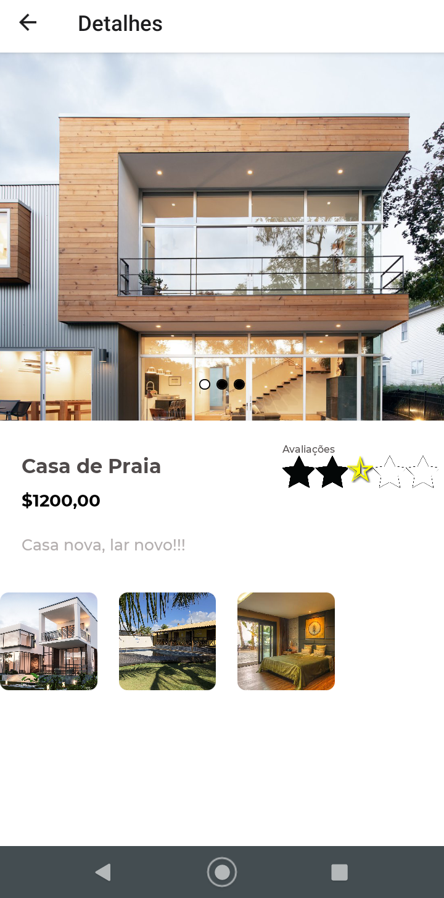

# alugue-app

## 🚀 Preview




## 📱 Tecnológias
- [Expo](https://docs.expo.io)
- [Typescript](https://www.typescriptlang.org/)
- [Eslint](https://eslint.org)
- [Prettier](https://prettier.io)
- [Styled Components](https://styled-components.com)

## 📥 Download

```bash
## clone o repositório
git clone https://github.com/rd-easy/alugue-app.git

## entre no diretório
cd alugue-app

## instale as dependências
npm install ou yarn add

## Run comando
expo start
```

### Feito com 💜 Iuri.Dev
